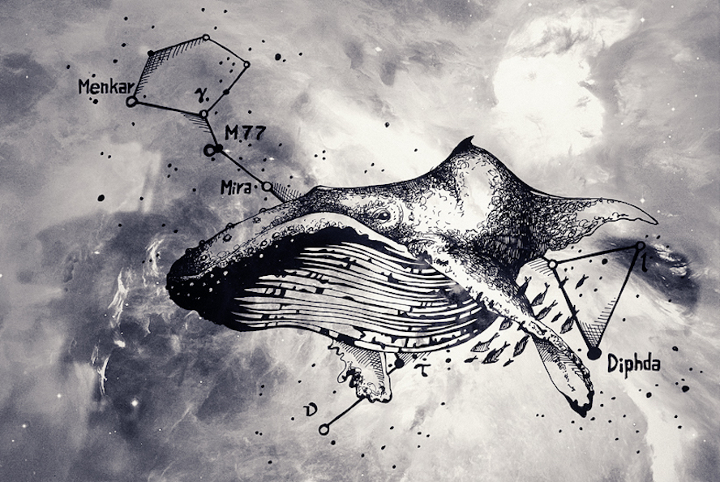

# Baleen
**An automated ingestion service for blogs to construct a corpus for NLP research.**

[![PyPI version][pypi_img]][pypi_href]
[![Build Status][travis_img]][travis_href]
[![Coverage Status][coveralls_img]][coverals_href]
[![Code Health][health_img]][health_href]
[![Documentation Status][rtfd_img]][rtfd_href]
[![Stories in Ready][waffle_img]][waffle_href]

[][spacewhale.jpg]

## Installtion Option #1: Install on Local Machine 

This quick start is intended to get you setup with Baleen in development mode (since the project is still under development). If you'd like to run Baleen in production, please see the [documentation][rtfd_href].

1. Clone the repository

    ```
$ git clone git@github.com:bbengfort/baleen.git
$ cd baleen
    ```

2. Create a virtualenv and install the dependencies

    ```
$ pyvenv venv  # or: virtualenv -p python3 venv
$ source venv/bin/activate
$ pip install -r requirements.txt
$ pip install nose==1.3.7 mongomock==3.2.1 coverage==4.0.3
    ```

3. Add the `baleen` module to your `$PYTHONPATH` via the virtualenv.

    ```
$ echo $(pwd) > venv/lib/python3.x/site-packages/baleen.pth
    ```

   Please replace *3.x* with the exact version of your Python.

4. Install and start mongoDB: https://docs.mongodb.com/manual/installation/

5. Create your local configuration file. Edit it with the connection details to your local MongoDB server.  This is also a good time to check and make sure that you can create a database called Baleen on Mongo.

    ```
$ cp conf/baleen-example.yaml conf/baleen.yaml
    ```

    ```yaml
debug: true
testing: false
database:
    host: localhost
    port: 27017
    name: baleen
server:
    host: 127.0.0.1
    port: 5000

    ```

6. Run the tests to make sure everything is ok.

    ```
$ make test
    ```

7. Make sure that the command line utility is ready to go:

    ```
$ bin/baleen --help
    ```

8. Import the feeds from the `feedly.opml` file in the fixtures.

    ```
$ bin/baleen load tests/fixtures/feedly.opml
Ingested 36 feeds from 1 OPML files
    ```

9. Perform an ingestion of the feeds that were imported from the `feedly.opml` file.

    ```
$ bin/baleen ingest
    ```

Your Mongo database collections should be created as you add new documents to them, and at this point you're ready to develop!

## Installation Option #2: Docker Setup

Included in this repository are files related to setting up the development environment using docker if you wish.

1. Install Docker Machine and Docker Compose e.g. with [Docker Toolbox](https://www.docker.com/products/docker-toolbox).

2. Type this command to build docker container: 

    ```
docker build -t "baleen_app_1" -f Dockerfile-app .
    ```

3. Clone the repository

    ```
$ git clone git@github.com:bbengfort/baleen.git
$ cd baleen
    ```

4. Create your local configuration file. Edit it with your configuration details; your MongoDB server will be at host `mongo`.

    ```
$ cp conf/baleen-example.yaml conf/baleen.yaml
    ```

    ```yaml
debug: true
testing: false
database:
    host: mongo
    port: 27017
    name: baleen
server:
    host: 127.0.0.1
    port: 5000
    ```

5. Exec interactively into the `app` container to interact with baleen as described in the above setup directions 6-9.

    ```
    docker exec -it baleen_app_1 /bin/bash
    ```

## Web Admin

There is a simple Flask application that ships with Baleen that provides information about the current status of the Baleen ingestion. This app can be run locally in development with the following command:

    $ bin/baleen serve

You can then reach the website at [http://127.0.0.1:5000/](http://127.0.0.1:5000/). Note that the host and port can be configured in the YAML configuration file or as command line arguments to the serve command.

### Deployment

The web application is deployed in production as an Nginx + uWSGI + Flask application that is managed by upstart.

## About

Baleen is a tool for ingesting _formal_ natural language data from the discourse of professional and amateur writers: e.g. bloggers and news outlets. Rather than performing web scraping, Baleen focuses on data ingestion through the use of RSS feeds. It performs as much raw data collection as it can, saving data into a Mongo document store.

### Throughput

[](https://waffle.io/bbengfort/baleen/metrics)

### Attribution

The image used in this README, ["Space Whale"][spacewhale.jpg] by [hbitik](http://hbitik.deviantart.com/) is licensed under [CC BY-NC-ND 3.0](http://creativecommons.org/licenses/by-nc-nd/3.0/)


<!-- References -->
[pypi_img]: https://badge.fury.io/py/baleen.svg
[pypi_href]: https://badge.fury.io/py/baleen
[travis_img]: https://travis-ci.org/bbengfort/baleen.svg?branch=master
[travis_href]: https://travis-ci.org/bbengfort/baleen/
[coveralls_img]: https://coveralls.io/repos/github/bbengfort/baleen/badge.svg?branch=master
[coverals_href]: https://coveralls.io/github/bbengfort/baleen?branch=master
[health_img]: https://landscape.io/github/bbengfort/baleen/master/landscape.svg?style=flat
[health_href]: https://landscape.io/github/bbengfort/baleen/master
[waffle_img]: https://badge.waffle.io/bbengfort/baleen.png?label=ready&title=Ready
[waffle_href]: https://waffle.io/bbengfort/baleen
[rtfd_img]: https://readthedocs.org/projects/baleen-ingest/badge/?version=latest
[rtfd_href]: http://baleen-ingest.readthedocs.org/
[spacewhale.jpg]: http://fav.me/d4736q3
